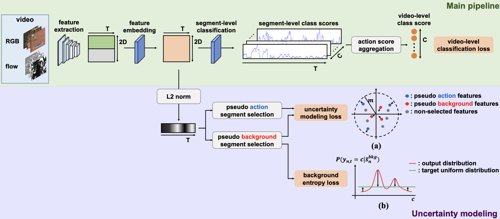

# UM

A PyTorch implementation of UM based on AAAI 2021 paper
[Weakly-supervised Temporal Action Localization by Uncertainty Modeling](https://arxiv.org/abs/2006.07006).



## Requirements

- [Anaconda](https://www.anaconda.com/download/)
- [PyTorch](https://pytorch.org)

```
conda install pytorch=1.10.0 torchvision cudatoolkit=11.3 -c pytorch
```

- [MMAction2](https://mmaction2.readthedocs.io)

```
pip install git+https://github.com/open-mmlab/mim.git
mim install mmaction2
```

## Dataset

[THUMOS 14](http://crcv.ucf.edu/THUMOS14/download.html) and
[ActivityNet](http://activity-net.org/download.html) datasets are used in this repo, you could download these datasets
from official websites. The I3D features of `THUMOS 14` dataset can be downloaded from
[Google Drive](https://drive.google.com/file/d/1NqaDRo782bGZKo662I0rI_cvpDT67VQU/view), I3D features
of `ActivityNet 1.2` dataset can be downloaded from
[OneDrive](https://emailucr-my.sharepoint.com/personal/sujoy_paul_email_ucr_edu/_layouts/15/onedrive.aspx?originalPath=aHR0cHM6Ly9lbWFpbHVjci1teS5zaGFyZXBvaW50LmNvbS86ZjovZy9wZXJzb25hbC9zdWpveV9wYXVsX2VtYWlsX3Vjcl9lZHUvRXMxemJIUVk0UHhLaFVrZGd2V0h0VTBCSy1feXVnYVNqWEs4NGtXc0IwWEQwdz9ydGltZT1vVlREWlhLUjJVZw&id=%2Fpersonal%2Fsujoy%5Fpaul%5Femail%5Fucr%5Fedu%2FDocuments%2Fwtalc%2Dfeatures)
, I3D features of `ActivityNet 1.3` dataset can be downloaded
from [Google Drive](https://drive.google.com/drive/folders/1W2t4UKUkV_9duAsAFWU0HHYWbav2CZXp). The data directory
structure is shown as follows:

 ```
├── thumos14                                    |  ├── activitynet
   ├── features                                  |    ├── features_1.2
       ├── val                                   |        ├── train 
           ├── flow                              |            ├── flow    
               ├── video_validation_0000051.npy  |                ├── v___dXUJsj3yo.npy
               └── ...                           |                └── ...
           ├── rgb (same structure as flow)      |            ├── rgb
       ├── test                                  |                ├── v___dXUJsj3yo.npy
           ├── flow                              |                └── ...
               ├── video_test_0000004.npy        |        ├── val (same structure as tain)
               └── ...                           |    ├── features_1.3 (same structure as features_1.2)
           ├── rgb (same structure as flow)      |    ├── videos
   ├── videos                                    |        ├── train
       ├── val                                   |            ├── v___c8enCfzqw.mp4
           ├── video_validation_0000051.mp4      |            └──... 
           └──...                                |         ├── val           
       ├── test                                  |            ├── v__1vYKA7mNLI.mp4
           ├──video_test_0000004.mp4             |            └──...   
           └──...                                | annotations_1.2.json
   annotations.json                              | annotations_1.3.json
```

## Usage

You can easily train and test the model by running the script below. If you want to try other options, please refer to
`utils.py`.

### Train Model

```
python train.py --data_name activitynet1.2 --num_segments 50 --seed 0
```

### Test Model

```
python test.py --model_file --data_name thumos14 --model_file result/thumos14_model.pth
```

## Benchmarks

The models are trained on one NVIDIA GeForce GTX 1080 Ti GPU (11G). All the hyper-parameters are the default values
according to the papers.

### THUMOS14

<table>
<thead>
  <tr>
    <th rowspan="3">Method</th>
    <th colspan="8">THUMOS14</th>
    <th rowspan="3">Download</th>
  </tr>
  <tr>
    <td align="center">mAP@0.1</td>
    <td align="center">mAP@0.2</td>
    <td align="center">mAP@0.3</td>
    <td align="center">mAP@0.4</td>
    <td align="center">mAP@0.5</td>
    <td align="center">mAP@0.6</td>
    <td align="center">mAP@0.7</td>
    <td align="center">mAP@AVG</td>
  </tr>
</thead>
<tbody>
  <tr>
    <td align="center">Ours</td>
    <td align="center">60.3</td>
    <td align="center">54.3</td>
    <td align="center">45.7</td>
    <td align="center">37.2</td>
    <td align="center">27.8</td>
    <td align="center">18.2</td>
    <td align="center">9.2</td>
    <td align="center">36.1</td>
    <td align="center"><a href="https://pan.baidu.com/s/1mv-RHb9VNu2FYBdzjNehPA">kb79</a></td>
  </tr>
  <tr>
    <td align="center">Official</td>
    <td align="center">67.5</td>
    <td align="center">61.2</td>
    <td align="center">52.3</td>
    <td align="center">43.4</td>
    <td align="center">33.7</td>
    <td align="center">22.9</td>
    <td align="center">12.1</td>
    <td align="center">41.9</td>
    <td align="center">-</td>
  </tr>
</tbody>
</table>

mAP@AVG is the average mAP under the thresholds 0.1:0.1:0.7.

### ActivityNet

<table>
<thead>
  <tr>
    <th rowspan="3">Method</th>
    <th colspan="4">ActivityNet 1.2</th>
    <th colspan="4">ActivityNet 1.3</th>
    <th rowspan="3">Download</th>
  </tr>
  <tr>
    <td align="center">mAP@0.5</td>
    <td align="center">mAP@0.75</td>
    <td align="center">mAP@0.95</td>
    <td align="center">mAP@AVG</td>
    <td align="center">mAP@0.5</td>
    <td align="center">mAP@0.75</td>
    <td align="center">mAP@0.95</td>
    <td align="center">mAP@AVG</td>
  </tr>
</thead>
<tbody>
  <tr>
    <td align="center">Ours</td>
    <td align="center">41.2</td>
    <td align="center">25.6</td>
    <td align="center">6.0</td>
    <td align="center">25.9</td>
    <td align="center">37.0</td>
    <td align="center">23.9</td>
    <td align="center">5.7</td>
    <td align="center">23.7</td>
    <td align="center"><a href="https://pan.baidu.com/s/11_7eu29IQ50rBU2W-dFceg">wexe</a></td>
  </tr>
  <tr>
    <td align="center">Official</td>
    <td align="center">41.2</td>
    <td align="center">25.6</td>
    <td align="center">6.0</td>
    <td align="center">25.9</td>
    <td align="center">37.0</td>
    <td align="center">23.9</td>
    <td align="center">5.7</td>
    <td align="center">23.7</td>
    <td align="center">-</td>
  </tr>
</tbody>
</table>

mAP@AVG is the average mAP under the thresholds 0.5:0.05:0.95.

## Reference

This repo is built upon the repo [WTAL-Uncertainty-Modeling](https://github.com/Pilhyeon/WTAL-Uncertainty-Modeling).
