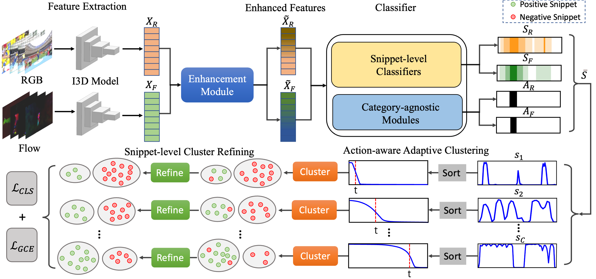

# ACRNet

A PyTorch implementation of ACRNet based on ICME 2023 paper
[Weakly-supervised Temporal Action Localization with Adaptive Clustering and Refining Network]().



## Requirements

- [Anaconda](https://www.anaconda.com/download/)
- [PyTorch](https://pytorch.org)

```
conda install pytorch torchvision torchaudio pytorch-cuda=11.6 -c pytorch -c nvidia
```

- [MMAction2](https://mmaction2.readthedocs.io)

```
pip install openmim
mim install mmaction2 -f https://github.com/open-mmlab/mmaction2.git
```

## Dataset

[THUMOS 14](http://crcv.ucf.edu/THUMOS14/download.html) and [ActivityNet](http://activity-net.org/download.html)
datasets are used in this repo, you should download these datasets from official websites. The RGB and Flow features of
these datasets are extracted by [dataset.py](dataset.py) with `25 FPS`. You should follow
[this link](https://gist.github.com/raulqf/f42c718a658cddc16f9df07ecc627be7) to install OpenCV4 with CUDA. And then
compile [denseFlow_GPU](https://github.com/daveboat/denseFlow_GPU), put the executable program in this dir. The options
could be found in [dataset.py](dataset.py), this script will take a lot of time to extract the features. Finally, I3D
features of these datasets are extracted by [this repo](https://github.com/Finspire13/pytorch-i3d-feature-extraction),
the `extract_features.py` file should be replaced with [extract.py](extract.py), the options could be found in
[extract.py](extract.py). To make this research friendly, we uploaded these I3D features in
[MEGA](https://mega.nz/folder/6sFxjaZB#Jtx69Kb2RHu2ldXoNzsODQ). You could download them from there, and make sure the
data directory structure is organized as follows:

 ```
├── thumos14                                    |  ├── activitynet
   ├── features                                  |   ├── features
       ├── val                                   |       ├── training 
           ├── video_validation_0000051_flow.npy |           ├── v___c8enCfzqw_flow.npy
           ├── video_validation_0000051_rgb.npy  |           ├── v___c8enCfzqw_rgb.npy
           └── ...                               |           └── ...                           
       ├── test                                  |       ├── validation                 
           ├── video_test_0000004_flow.npy       |           ├── v__1vYKA7mNLI_flow.npy  
           ├── video_test_0000004_rgb.npy        |           ├── v__1vYKA7mNLI_rgb.npy 
           └── ...                               |           └── ...     
   ├── videos                                    |   ├── videos  
       ├── val                                   |       ├── training      
           ├── video_validation_0000051.mp4      |           ├── v___c8enCfzqw.mp4
           └──...                                |           └──...        
       ├── test                                  |       ├── validation           
           ├── video_test_0000004.mp4            |           ├── v__1vYKA7mNLI.mp4
           └──...                                |           └──...      
   annotations.json                              |    annotations_1.2.json, annotations_1.3.json
```

## Usage

You can easily train and test the model by running the script below. If you want to try other options, please refer to
[utils.py](utils.py).

### Train Model

```
python main.py --data_name activitynet1.2 --num_segments 80 --seed 42
```

### Test Model

```
python main.py --data_name thumos14 --model_file result/thumos14.pth
```

## Benchmarks

The models are trained on one NVIDIA GeForce RTX 3090 GPU (24G). `seed` is `42` for all datasets, `num_seg` is `80`,
`alpha` is `0.8` and `batch_size` is `128` for both `activitynet1.2&1.3` datasets, the other hyper-parameters are the
default values.

### THUMOS14

<table>
<thead>
  <tr>
    <th rowspan="3">Method</th>
    <th colspan="8">THUMOS14</th>
    <th rowspan="3">Download</th>
  </tr>
  <tr>
    <td align="center">mAP@0.1</td>
    <td align="center">mAP@0.2</td>
    <td align="center">mAP@0.3</td>
    <td align="center">mAP@0.4</td>
    <td align="center">mAP@0.5</td>
    <td align="center">mAP@0.6</td>
    <td align="center">mAP@0.7</td>
    <td align="center">mAP@AVG</td>
  </tr>
</thead>
<tbody>
  <tr>
    <td align="center">ACRNet</td>
    <td align="center">75.4</td>
    <td align="center">69.4</td>
    <td align="center">60.0</td>
    <td align="center">48.2</td>
    <td align="center">36.4</td>
    <td align="center">24.1</td>
    <td align="center">13.1</td>
    <td align="center">46.7</td>
    <td align="center"><a href="https://mega.nz/folder/Wp8A3a7C#bxvp6NuLMUoFJ5oZD1Z2dw">MEGA</a></td>
  </tr>
</tbody>
</table>

mAP@AVG is the average mAP under the thresholds 0.1:0.1:0.7.

### ActivityNet

<table>
<thead>
  <tr>
    <th rowspan="3">Method</th>
    <th colspan="4">ActivityNet 1.2</th>
    <th colspan="4">ActivityNet 1.3</th>
    <th rowspan="3">Download</th>
  </tr>
  <tr>
    <td align="center">mAP@0.5</td>
    <td align="center">mAP@0.75</td>
    <td align="center">mAP@0.95</td>
    <td align="center">mAP@AVG</td>
    <td align="center">mAP@0.5</td>
    <td align="center">mAP@0.75</td>
    <td align="center">mAP@0.95</td>
    <td align="center">mAP@AVG</td>
  </tr>
</thead>
<tbody>
  <tr>
    <td align="center">ACRNet</td>
    <td align="center">46.2</td>
    <td align="center">28.4</td>
    <td align="center">5.7</td>
    <td align="center">28.4</td>
    <td align="center">40.9</td>
    <td align="center">26.0</td>
    <td align="center">5.4</td>
    <td align="center">25.7</td>
    <td align="center"><a href="https://mega.nz/folder/25sjxQJb#ypIrl0AWG7sFpD3KfQ1xLg">MEGA</a></td>
  </tr>
</tbody>
</table>

mAP@AVG is the average mAP under the thresholds 0.5:0.05:0.95.
