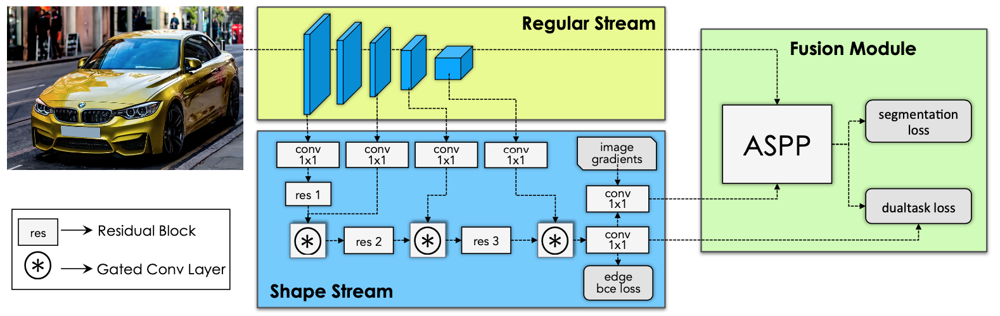

# Gated-SCNN

A PyTorch implementation of Gated-SCNN based on ICCV 2019
paper [Gated-SCNN: Gated Shape CNNs for Semantic Segmentation](https://arxiv.org/abs/1907.05740).



## Requirements

```
pip install -r requirements.txt
git clone https://github.com/alexandrosstergiou/SoftPool.git
cd SoftPool/pytorch
make install
```

## Usage

### Train model

```
python train.py --batch_size 8 --epochs 175
optional arguments:
--data_path                   Data path for training dataset [default value is '../tcdata/suichang_round1_train_210120']
--batch_size                  Number of data for each batch to train [default value is 16]
--epochs                      Number of sweeps over the dataset to train [default value is 80]
--save_path                   Save path for results [default value is '../user_data']
```

### Test model

```
python test.py --data_path ../tcdata/suichang_round2_test_partB_210316
optional arguments:
--data_path                   Data path for testing dataset [default value is '../tcdata/suichang_round1_test_partA_210120']
--model_weight                Pretrained model weight [default value is '../user_data/model.pth']
--batch_size                  Number of data for each batch to test [default value is 16]
--save_path                   Save path for results [default value is '../prediction_result']
```

### Eval model

```
python viewer.py --input_pic ../tcdata/suichang_round1_train_210120/000001.tif
optional arguments:
--model_weight                Pretrained model weight [default value is '../user_data/model.pth']
--input_pic                   Path to the input picture [default value is '../tcdata/suichang_round1_test_partA_210120/000001.tif']
```

## Notes

The experiment is conducted on one NVIDIA TITAN RTX (24G) GPU, and there are some difference between this implementation
and official implementation:

1. `Multi-scale training` is used, the scale is random selected from `[0.5, 0.75, 1.0, 1.25, 1.5, 1.75, 2.0]`;
2. The `poly lr scheduler` is called each iter;
3. The non-differentiable part of `dual task loss` is not used;
4. `SoftPool` is used to replace the `MaxPool`.
