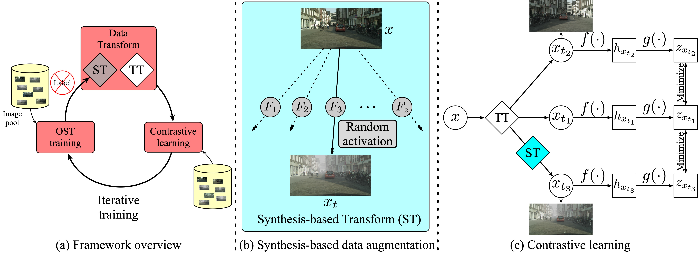
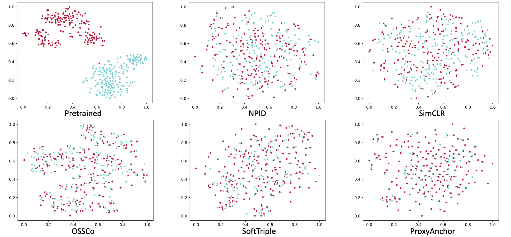

# ZsCo

A PyTorch implementation of ZsCo based on ACM MM 2021 paper [Zero-shot Contrast Learning for Image Retrieval]().



## Requirements

- [Anaconda](https://www.anaconda.com/download/)
- [PyTorch](https://pytorch.org)

```
conda install pytorch=1.7.1 torchvision cudatoolkit=11.0 -c pytorch
```

- [Pytorch Metric Learning](https://kevinmusgrave.github.io/pytorch-metric-learning/)

```
pip install pytorch-metric-learning
```

- [THOP](https://github.com/Lyken17/pytorch-OpCounter)

```
pip install thop
```

- bidict

```
pip install bidict
```

## Dataset

[PACS](https://domaingeneralization.github.io) and [Office-Home](https://www.hemanthdv.org/officeHomeDataset.html)
datasets are used in this repo, you could download these datasets from official websites, or download them from
[MEGA](https://mega.nz/folder/cspmEISJ#uetXIhSBHvQBqDMh0Z4Ejg). The data should be rearranged, please refer the paper to
acquire the details of `train/val` split. The data directory structure is shown as follows:

 ```
pacs
    ├── art (art images)
        ├── dog
            pic_001.jpg
            ...    
        ...  
    ├── cartoon (cartoon images)
        same structure as art
        ...   
    ...        
office
    same structure as pacs
```

## Usage

```
python main.py or comp.py --data_name office
optional arguments:
# common args
--data_root                   Datasets root path [default value is 'data']
--data_name                   Dataset name [default value is 'pacs'](choices=['pacs', 'office'])
--method_name                 Compared method name [default value is 'zsco'](choices=['zsco', 'simsiam', 'simclr', 'npid', 'proxyanchor', 'softtriple', 'pretrained'])
--train_domains               Selected domains to train [default value is ['art', 'cartoon']]
--val_domains                 Selected domains to val [default value is ['photo', 'sketch']]
--hidden_dim                  Hidden feature dim for prediction head [default value is 512]
--temperature                 Temperature used in softmax [default value is 0.1]
--batch_size                  Number of images in each mini-batch [default value is 32]
--total_iter                  Number of bp to train [default value is 10000]
--ranks                       Selected recall to val [default value is [1, 5, 10]]
--save_root                   Result saved root path [default value is 'result']
# args for zsco
--style_num                   Number of used styles [default value is 8]
--gan_iter                    Number of bp to train gan model [default value is 4000]
--rounds                      Number of round to train whole model [default value is 5]
```

For example, to train `npid` on `office` dataset with domain `art` and `clipart`, and test with domain `product`
and `real`:

```
python comp.py --method_name npid --data_name office --batch_size 64 --train_domains art clipart --val_domains product real
```

to train `zsco` on `pacs` dataset, with `16` random selected styles:

```
python main.py --method_name zsco --data_name pacs --style_num 16
```

## Benchmarks

The models are trained on one NVIDIA GTX TITAN (12G) GPU. `Adam` is used to optimize the model, `lr` is `1e-3`
and `weight decay` is `1e-6`. `batch size` is `32` for `zsco`, `simsiam` and `simclr`, `64` for `npid`, `proxyanchor`
and `softtriple`. `lr` is `2e-4` and `betas` is `(0.5, 0.999)` for GAN, other hyper-parameters are the default values.

### PACS

<table>
<thead>
  <tr>
    <th rowspan="2">Method</th>
    <th colspan="3">Art --&gt; Cartoon</th>
    <th colspan="3">Cartoon --&gt; Art</th>
    <th colspan="3">Art --&gt; Photo</th>
    <th colspan="3">Photo --&gt; Art</th>
    <th colspan="3">Art --&gt; Sketch</th>
    <th colspan="3">Sketch --&gt; Art</th>
    <th colspan="3">Cartoon --&gt; Photo</th>
    <th colspan="3">Photo --&gt; Cartoon</th>
    <th colspan="3">Cartoon --&gt; Sketch</th>
    <th colspan="3">Sketch --&gt; Cartoon</th>
    <th colspan="3">Photo --&gt; Sketch</th>
    <th colspan="3">Sketch --&gt; Photo</th>    
    <th rowspan="2">Download</th>
  </tr>
  <tr>
    <td align="center">R@1</td>
    <td align="center">R@5</td>
    <td align="center">R@10</td>
    <td align="center">R@1</td>
    <td align="center">R@5</td>
    <td align="center">R@10</td>
    <td align="center">R@1</td>
    <td align="center">R@5</td>
    <td align="center">R@10</td>
    <td align="center">R@1</td>
    <td align="center">R@5</td>
    <td align="center">R@10</td>
    <td align="center">R@1</td>
    <td align="center">R@5</td>
    <td align="center">R@10</td>
    <td align="center">R@1</td>
    <td align="center">R@5</td>
    <td align="center">R@10</td>
    <td align="center">R@1</td>
    <td align="center">R@5</td>
    <td align="center">R@10</td>
    <td align="center">R@1</td>
    <td align="center">R@5</td>
    <td align="center">R@10</td>
    <td align="center">R@1</td>
    <td align="center">R@5</td>
    <td align="center">R@10</td>
    <td align="center">R@1</td>
    <td align="center">R@5</td>
    <td align="center">R@10</td>
    <td align="center">R@1</td>
    <td align="center">R@5</td>
    <td align="center">R@10</td>
    <td align="center">R@1</td>
    <td align="center">R@5</td>
    <td align="center">R@10</td>
  </tr>
</thead>
<tbody>
  <tr>
    <td align="center">Pretrained</td>
    <td align="center">56.2</td>
    <td align="center">82.5</td>
    <td align="center">89.4</td>
    <td align="center">45.7</td>
    <td align="center">77.5</td>
    <td align="center">89.6</td>
    <td align="center">52.7</td>
    <td align="center">70.8</td>
    <td align="center">77.7</td>
    <td align="center">94.4</td>
    <td align="center">98.6</td>
    <td align="center">99.3</td>
    <td align="center">23.8</td>
    <td align="center">42.3</td>
    <td align="center">51.5</td>
    <td align="center">32.0</td>
    <td align="center">72.4</td>
    <td align="center">89.1</td>
    <td align="center">27.0</td>
    <td align="center">46.4</td>
    <td align="center">59.0</td>
    <td align="center">84.6</td>
    <td align="center">93.8</td>
    <td align="center">96.6</td>
    <td align="center">32.0</td>
    <td align="center">58.3</td>
    <td align="center">67.2</td>
    <td align="center">30.0</td>
    <td align="center">66.0</td>
    <td align="center">78.7</td>
    <td align="center">28.4</td>
    <td align="center">46.5</td>
    <td align="center">59.5</td>
    <td align="center">21.9</td>
    <td align="center">37.0</td>
    <td align="center">54.0</td>
    <td align="center"><a href="https://pan.baidu.com/s/1G9qdUvrFHqEm1kbmPmel9w">ea3u</a></td>
  </tr>
  <tr>
    <td align="center">NPID</td>
    <td align="center">20.5</td>
    <td align="center">55.5</td>
    <td align="center">71.7</td>
    <td align="center">20.4</td>
    <td align="center">60.2</td>
    <td align="center">79.5</td>
    <td align="center">18.1</td>
    <td align="center">54.2</td>
    <td align="center">77.3</td>
    <td align="center">19.5</td>
    <td align="center">58.7</td>
    <td align="center">81.1</td>
    <td align="center">20.1</td>
    <td align="center">33.4</td>
    <td align="center">57.2</td>
    <td align="center">21.9</td>
    <td align="center">77.7</td>
    <td align="center">80.2</td>
    <td align="center">17.6</td>
    <td align="center">50.9</td>
    <td align="center">72.6</td>
    <td align="center">20.0</td>
    <td align="center">58.2</td>
    <td align="center">76.2</td>
    <td align="center">23.8</td>
    <td align="center">49.7</td>
    <td align="center">63.5</td>
    <td align="center">20.7</td>
    <td align="center">55.8</td>
    <td align="center">69.9</td>
    <td align="center">15.6</td>
    <td align="center">42.2</td>
    <td align="center">52.8</td>
    <td align="center">26.5</td>
    <td align="center">40.5</td>
    <td align="center">65.3</td>
    <td align="center"><a href="https://pan.baidu.com/s/1PWLOBKWb8gUUibXOX9OQyA">hu2k</a></td>
  </tr>
  <tr>
    <td align="center">SimCLR</td>
    <td align="center">18.9</td>
    <td align="center">50.1</td>
    <td align="center">68.5</td>
    <td align="center">18.0</td>
    <td align="center">59.0</td>
    <td align="center">77.6</td>
    <td align="center">18.6</td>
    <td align="center">49.9</td>
    <td align="center">67.2</td>
    <td align="center">23.9</td>
    <td align="center">61.0</td>
    <td align="center">78.7</td>
    <td align="center">16.6</td>
    <td align="center">44.1</td>
    <td align="center">58.9</td>
    <td align="center">26.2</td>
    <td align="center">71.3</td>
    <td align="center">86.8</td>
    <td align="center">19.1</td>
    <td align="center">52.6</td>
    <td align="center">70.7</td>
    <td align="center">20.2</td>
    <td align="center">56.6</td>
    <td align="center">75.3</td>
    <td align="center">20.1</td>
    <td align="center">53.6</td>
    <td align="center">68.8</td>
    <td align="center">24.8</td>
    <td align="center">62.6</td>
    <td align="center">81.1</td>
    <td align="center">24.9</td>
    <td align="center">51.8</td>
    <td align="center">65.9</td>
    <td align="center">24.7</td>
    <td align="center">49.3</td>
    <td align="center">73.5</td>
    <td align="center"><a href="https://pan.baidu.com/s/1aJGLPODKE4cCHLZYDg96jA">4jvm</a></td>
  </tr>
  <tr>
    <td align="center">SimSiam</td>
    <td align="center">20.7</td>
    <td align="center">56.3</td>
    <td align="center">72.9</td>
    <td align="center">21.2</td>
    <td align="center">59.8</td>
    <td align="center">77.8</td>
    <td align="center">19.0</td>
    <td align="center">52.2</td>
    <td align="center">70.5</td>
    <td align="center">20.0</td>
    <td align="center">58.7</td>
    <td align="center">79.6</td>
    <td align="center">18.8</td>
    <td align="center">42.9</td>
    <td align="center">54.0</td>
    <td align="center">26.8</td>
    <td align="center">62.0</td>
    <td align="center">80.5</td>
    <td align="center">22.4</td>
    <td align="center">58.8</td>
    <td align="center">78.2</td>
    <td align="center">19.7</td>
    <td align="center">53.5</td>
    <td align="center">69.3</td>
    <td align="center">20.6</td>
    <td align="center">40.0</td>
    <td align="center">48.3</td>
    <td align="center">20.0</td>
    <td align="center">59.9</td>
    <td align="center">76.0</td>
    <td align="center">23.4</td>
    <td align="center">55.7</td>
    <td align="center">68.5</td>
    <td align="center">22.7</td>
    <td align="center">51.7</td>
    <td align="center">68.7</td>
    <td align="center"><a href="https://pan.baidu.com/s/1aJGLPODKE4cCHLZYDg96jA">4jvm</a></td>
  </tr>
  <tr>
    <td align="center">SoftTriple</td>
    <td align="center">27.6</td>
    <td align="center">65.3</td>
    <td align="center">80.5</td>
    <td align="center">34.6</td>
    <td align="center">71.5</td>
    <td align="center">85.1</td>
    <td align="center">25.8</td>
    <td align="center">59.1</td>
    <td align="center">74.7</td>
    <td align="center">31.1</td>
    <td align="center">69.6</td>
    <td align="center">84.8</td>
    <td align="center">30.7</td>
    <td align="center">56.9</td>
    <td align="center">65.8</td>
    <td align="center">38.3</td>
    <td align="center">73.8</td>
    <td align="center">86.2</td>
    <td align="center">42.4</td>
    <td align="center">73.8</td>
    <td align="center">83.6</td>
    <td align="center">42.7</td>
    <td align="center">73.4</td>
    <td align="center">83.3</td>
    <td align="center">36.4</td>
    <td align="center">68.7</td>
    <td align="center">80.9</td>
    <td align="center">36.8</td>
    <td align="center">72.8</td>
    <td align="center">87.0</td>
    <td align="center">42.3</td>
    <td align="center">71.9</td>
    <td align="center">83.0</td>
    <td align="center">42.2</td>
    <td align="center">76.6</td>
    <td align="center">86.3</td>
    <td align="center"><a href="https://pan.baidu.com/s/1mYIRpX4ABX9YVLs0gFJVmg">6we5</a></td>
  </tr>
  <tr>
    <td align="center">ProxyAnchor</td>
    <td align="center">25.4</td>
    <td align="center">58.9</td>
    <td align="center">74.6</td>
    <td align="center">31.1</td>
    <td align="center">67.5</td>
    <td align="center">83.7</td>
    <td align="center">22.9</td>
    <td align="center">58.4</td>
    <td align="center">75.7</td>
    <td align="center">30.5</td>
    <td align="center">67.5</td>
    <td align="center">83.2</td>
    <td align="center">27.3</td>
    <td align="center">57.9</td>
    <td align="center">69.2</td>
    <td align="center">35.9</td>
    <td align="center">72.1</td>
    <td align="center">86.3</td>
    <td align="center">35.3</td>
    <td align="center">60.4</td>
    <td align="center">72.4</td>
    <td align="center">34.5</td>
    <td align="center">64.4</td>
    <td align="center">79.8</td>
    <td align="center">31.4</td>
    <td align="center">66.0</td>
    <td align="center">80.1</td>
    <td align="center">32.5</td>
    <td align="center">71.5</td>
    <td align="center">86.5</td>
    <td align="center">45.0</td>
    <td align="center">73.2</td>
    <td align="center">82.3</td>
    <td align="center">43.9</td>
    <td align="center">74.2</td>
    <td align="center">84.1</td>
    <td align="center"><a href="https://pan.baidu.com/s/1aEQhoDH3ciAHESbzSfeR6Q">99k3</a></td>
  </tr>
  <tr>
    <td align="center">ZsCo</td>
    <td align="center"><b></b></td>
    <td align="center"><b></b></td>
    <td align="center"><b></b></td>
    <td align="center"><b></b></td>
    <td align="center"><b></b></td>
    <td align="center"><b></b></td>
    <td align="center"><b></b></td>
    <td align="center"><b></b></td>
    <td align="center"><b></b></td>
    <td align="center"><b></b></td>
    <td align="center"><b></b></td>
    <td align="center"><b></b></td>
    <td align="center"><b></b></td>
    <td align="center"><b></b></td>
    <td align="center"><b></b></td>
    <td align="center"><b></b></td>
    <td align="center"><b></b></td>
    <td align="center"><b></b></td>
    <td align="center"><b></b></td>
    <td align="center"><b></b></td>
    <td align="center"><b></b></td>
    <td align="center"><b></b></td>
    <td align="center"><b></b></td>
    <td align="center"><b></b></td>
    <td align="center"><b></b></td>
    <td align="center"><b></b></td>
    <td align="center"><b></b></td>
    <td align="center"><b></b></td>
    <td align="center"><b></b></td>
    <td align="center"><b></b></td>
    <td align="center"><b></b></td>
    <td align="center"><b></b></td>
    <td align="center"><b></b></td>
    <td align="center"><b></b></td>
    <td align="center"><b></b></td>
    <td align="center"><b></b></td>
    <td align="center"><a href="https://pan.baidu.com/s/19d3v1PTnX-Z3dH7ifeY1oA">cb2b</a></td>
  </tr>
</tbody>
</table>

### Office-Home

<table>
<thead>
  <tr>
    <th rowspan="2">Method</th>
    <th colspan="3">Art --&gt; Clipart</th>
    <th colspan="3">Clipart --&gt; Art</th>
    <th colspan="3">Art --&gt; Product</th>
    <th colspan="3">Product --&gt; Art</th>
    <th colspan="3">Art --&gt; Real</th>
    <th colspan="3">Real --&gt; Art</th>
    <th colspan="3">Clipart --&gt; Product</th>
    <th colspan="3">Product --&gt; Clipart</th>
    <th colspan="3">Clipart --&gt; Real</th>
    <th colspan="3">Real --&gt; Clipart</th>
    <th colspan="3">Product --&gt; Real</th>
    <th colspan="3">Real --&gt; Product</th>    
    <th rowspan="2">Download</th>
  </tr>
  <tr>
    <td align="center">R@1</td>
    <td align="center">R@5</td>
    <td align="center">R@10</td>
    <td align="center">R@1</td>
    <td align="center">R@5</td>
    <td align="center">R@10</td>
    <td align="center">R@1</td>
    <td align="center">R@5</td>
    <td align="center">R@10</td>
    <td align="center">R@1</td>
    <td align="center">R@5</td>
    <td align="center">R@10</td>
    <td align="center">R@1</td>
    <td align="center">R@5</td>
    <td align="center">R@10</td>
    <td align="center">R@1</td>
    <td align="center">R@5</td>
    <td align="center">R@10</td>
    <td align="center">R@1</td>
    <td align="center">R@5</td>
    <td align="center">R@10</td>
    <td align="center">R@1</td>
    <td align="center">R@5</td>
    <td align="center">R@10</td>
    <td align="center">R@1</td>
    <td align="center">R@5</td>
    <td align="center">R@10</td>
    <td align="center">R@1</td>
    <td align="center">R@5</td>
    <td align="center">R@10</td>
    <td align="center">R@1</td>
    <td align="center">R@5</td>
    <td align="center">R@10</td>
    <td align="center">R@1</td>
    <td align="center">R@5</td>
    <td align="center">R@10</td>
  </tr>
</thead>
<tbody>
  <tr>
    <td align="center">Pretrained</td>
    <td align="center">46.7</td>
    <td align="center">68.4</td>
    <td align="center">77.7</td>
    <td align="center">30.5</td>
    <td align="center">51.2</td>
    <td align="center">61.3</td>
    <td align="center">48.6</td>
    <td align="center">67.7</td>
    <td align="center">75.8</td>
    <td align="center">54.0</td>
    <td align="center">75.3</td>
    <td align="center">83.4</td>
    <td align="center">57.3</td>
    <td align="center">76.8</td>
    <td align="center">83.1</td>
    <td align="center">62.4</td>
    <td align="center">81.4</td>
    <td align="center">88.7</td>
    <td align="center">37.1</td>
    <td align="center">53.6</td>
    <td align="center">61.3</td>
    <td align="center">53.9</td>
    <td align="center">74.8</td>
    <td align="center">82.2</td>
    <td align="center">38.9</td>
    <td align="center">57.6</td>
    <td align="center">64.9</td>
    <td align="center">55.7</td>
    <td align="center">76.9</td>
    <td align="center">84.0</td>
    <td align="center">71.2</td>
    <td align="center">87.1</td>
    <td align="center">91.8</td>
    <td align="center">67.4</td>
    <td align="center">83.5</td>
    <td align="center">88.3</td>
    <td align="center"><a href="https://pan.baidu.com/s/1G9qdUvrFHqEm1kbmPmel9w">ea3u</a></td>
  </tr>
  <tr>
    <td align="center">NPID</td>
    <td align="center">2.4</td>
    <td align="center">9.4</td>
    <td align="center">17.4</td>
    <td align="center">3.0</td>
    <td align="center">11.1</td>
    <td align="center">18.6</td>
    <td align="center">3.4</td>
    <td align="center">10.9</td>
    <td align="center">17.9</td>
    <td align="center">3.0</td>
    <td align="center">11.2</td>
    <td align="center">19.2</td>
    <td align="center">4.1</td>
    <td align="center">12.1</td>
    <td align="center">19.8</td>
    <td align="center">3.3</td>
    <td align="center">11.2</td>
    <td align="center">19.4</td>
    <td align="center">3.1</td>
    <td align="center">10.8</td>
    <td align="center">18.4</td>
    <td align="center">3.5</td>
    <td align="center">12.5</td>
    <td align="center">20.3</td>
    <td align="center">4.9</td>
    <td align="center">15.5</td>
    <td align="center">24.6</td>
    <td align="center">4.7</td>
    <td align="center">13.7</td>
    <td align="center">22.2</td>
    <td align="center">4.4</td>
    <td align="center">14.3</td>
    <td align="center">23.7</td>
    <td align="center">3.1</td>
    <td align="center">11.2</td>
    <td align="center">18.5</td>
    <td align="center"><a href="https://pan.baidu.com/s/1PWLOBKWb8gUUibXOX9OQyA">hu2k</a></td>
  </tr>
  <tr>
    <td align="center">SimCLR</td>
    <td align="center">4.3</td>
    <td align="center">12.7</td>
    <td align="center">20.0</td>
    <td align="center">4.1</td>
    <td align="center">14.8</td>
    <td align="center">23.3</td>
    <td align="center">4.5</td>
    <td align="center">13.6</td>
    <td align="center">20.4</td>
    <td align="center">4.7</td>
    <td align="center">15.8</td>
    <td align="center">25.8</td>
    <td align="center">5.3</td>
    <td align="center">16.4</td>
    <td align="center">26.0</td>
    <td align="center">4.8</td>
    <td align="center">16.3</td>
    <td align="center">26.3</td>
    <td align="center">5.4</td>
    <td align="center">15.8</td>
    <td align="center">24.2</td>
    <td align="center">5.3</td>
    <td align="center">16.4</td>
    <td align="center">26.2</td>
    <td align="center">5.8</td>
    <td align="center">17.9</td>
    <td align="center">28.2</td>
    <td align="center">5.2</td>
    <td align="center">15.4</td>
    <td align="center">24.4</td>
    <td align="center">7.6</td>
    <td align="center">22.4</td>
    <td align="center">33.2</td>
    <td align="center">5.9</td>
    <td align="center">18.2</td>
    <td align="center">27.6</td>
    <td align="center"><a href="https://pan.baidu.com/s/1aJGLPODKE4cCHLZYDg96jA">4jvm</a></td>
  </tr>
  <tr>
    <td align="center">SimSiam</td>
    <td align="center">2.8</td>
    <td align="center">10.2</td>
    <td align="center">17.3</td>
    <td align="center">2.6</td>
    <td align="center">10.2</td>
    <td align="center">17.5</td>
    <td align="center">2.7</td>
    <td align="center">8.6</td>
    <td align="center">15.3</td>
    <td align="center">2.3</td>
    <td align="center">9.6</td>
    <td align="center">16.9</td>
    <td align="center">4.1</td>
    <td align="center">13.6</td>
    <td align="center">20.6</td>
    <td align="center">3.1</td>
    <td align="center">11.8</td>
    <td align="center">20.5</td>
    <td align="center">3.4</td>
    <td align="center">12.7</td>
    <td align="center">21.6</td>
    <td align="center">3.5</td>
    <td align="center">12.2</td>
    <td align="center">20.9</td>
    <td align="center">3.4</td>
    <td align="center">11.4</td>
    <td align="center">20.1</td>
    <td align="center">3.0</td>
    <td align="center">11.7</td>
    <td align="center">19.7</td>
    <td align="center">3.4</td>
    <td align="center">11.3</td>
    <td align="center">20.1</td>
    <td align="center">2.9</td>
    <td align="center">11.1</td>
    <td align="center">18.3</td>
    <td align="center"><a href="https://pan.baidu.com/s/1aJGLPODKE4cCHLZYDg96jA">4jvm</a></td>
  </tr>
  <tr>
    <td align="center">SoftTriple</td>
    <td align="center">9.9</td>
    <td align="center">24.3</td>
    <td align="center">33.8</td>
    <td align="center">9.8</td>
    <td align="center">27.5</td>
    <td align="center">38.5</td>
    <td align="center">10.1</td>
    <td align="center">21.8</td>
    <td align="center">30.3</td>
    <td align="center">13.0</td>
    <td align="center">32.1</td>
    <td align="center">44.0</td>
    <td align="center">9.2</td>
    <td align="center">25.6</td>
    <td align="center">35.5</td>
    <td align="center">12.4</td>
    <td align="center">29.8</td>
    <td align="center">41.4</td>
    <td align="center">10.1</td>
    <td align="center">24.8</td>
    <td align="center">35.9</td>
    <td align="center">11.9</td>
    <td align="center">29.6</td>
    <td align="center">40.6</td>
    <td align="center">13.4</td>
    <td align="center">29.9</td>
    <td align="center">40.3</td>
    <td align="center">11.8</td>
    <td align="center">28.4</td>
    <td align="center">40.7</td>
    <td align="center">13.9</td>
    <td align="center">33.8</td>
    <td align="center">46.3</td>
    <td align="center">13.2</td>
    <td align="center">28.8</td>
    <td align="center">38.4</td>
    <td align="center"><a href="https://pan.baidu.com/s/1mYIRpX4ABX9YVLs0gFJVmg">6we5</a></td>
  </tr>
  <tr>
    <td align="center">ProxyAnchor</td>
    <td align="center">10.8</td>
    <td align="center">24.8</td>
    <td align="center">34.1</td>
    <td align="center">12.8</td>
    <td align="center">29.6</td>
    <td align="center">39.6</td>
    <td align="center">13.0</td>
    <td align="center">26.4</td>
    <td align="center">34.4</td>
    <td align="center">19.4</td>
    <td align="center">37.9</td>
    <td align="center">48.4</td>
    <td align="center">11.8</td>
    <td align="center">27.5</td>
    <td align="center">37.2</td>
    <td align="center">16.3</td>
    <td align="center">34.3</td>
    <td align="center">46.2</td>
    <td align="center">10.7</td>
    <td align="center">26.8</td>
    <td align="center">36.0</td>
    <td align="center">12.7</td>
    <td align="center">28.8</td>
    <td align="center">40.6</td>
    <td align="center">12.8</td>
    <td align="center">29.2</td>
    <td align="center">40.5</td>
    <td align="center">13.1</td>
    <td align="center">30.6</td>
    <td align="center">41.9</td>
    <td align="center">16.7</td>
    <td align="center">36.3</td>
    <td align="center">48.1</td>
    <td align="center">13.4</td>
    <td align="center">30.4</td>
    <td align="center">40.8</td>
    <td align="center"><a href="https://pan.baidu.com/s/1aEQhoDH3ciAHESbzSfeR6Q">99k3</a></td>
  </tr>
  <tr>
    <td align="center">ZsCo</td>
    <td align="center"><b></b></td>
    <td align="center"><b></b></td>
    <td align="center"><b></b></td>
    <td align="center"><b></b></td>
    <td align="center"><b></b></td>
    <td align="center"><b></b></td>
    <td align="center"><b></b></td>
    <td align="center"><b></b></td>
    <td align="center"><b></b></td>
    <td align="center"><b></b></td>
    <td align="center"><b></b></td>
    <td align="center"><b></b></td>
    <td align="center"><b></b></td>
    <td align="center"><b></b></td>
    <td align="center"><b></b></td>
    <td align="center"><b></b></td>
    <td align="center"><b></b></td>
    <td align="center"><b></b></td>
    <td align="center"><b></b></td>
    <td align="center"><b></b></td>
    <td align="center"><b></b></td>
    <td align="center"><b></b></td>
    <td align="center"><b></b></td>
    <td align="center"><b></b></td>
    <td align="center"><b></b></td>
    <td align="center"><b></b></td>
    <td align="center"><b></b></td>
    <td align="center"><b></b></td>
    <td align="center"><b></b></td>
    <td align="center"><b></b></td>
    <td align="center"><b></b></td>
    <td align="center"><b></b></td>
    <td align="center"><b></b></td>
    <td align="center"><b></b></td>
    <td align="center"><b></b></td>
    <td align="center"><b></b></td>
    <td align="center"><a href="https://pan.baidu.com/s/19d3v1PTnX-Z3dH7ifeY1oA">cb2b</a></td>
  </tr>
</tbody>
</table>

### T-SNE


